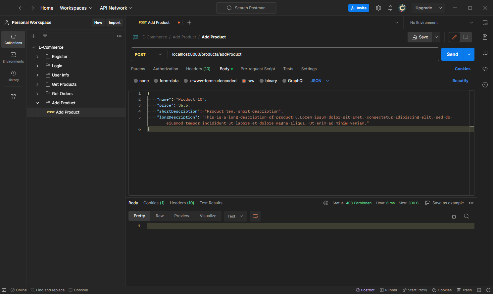

<h1>E-Commerce Spring Boot API</h1>

<p>This project contains an E-commerce API developed using Java and Spring Boot. The API supports fundamental e-commerce operations such as user registration, login, viewing products, adding new products, and viewing order histories.
</p>

<h2>Getting Started :rocket:</h2>
If you want to run the project on your local machine, add an 'application.properties' file to the 'resources' folder and include the following configuration inside also customize these properties according to your needs:

```properties
spring.datasource.url=jdbc:mysql://localhost:3306/ecommerce
spring.datasource.username=root
spring.datasource.password=yourPassword

spring.jpa.database=MYSQL
spring.jpa.show-sql=true
spring.jpa.hibernate.ddl-auto=update

encryption.salt.rounds=10
jwt.issuer=eCommerce
jwt.algorithm.key="YourSecretKey"
jwt.expiryInSeconds=604800
```

<h2>Used Technologies :computer:</h2>
<ul>
  <li>Java</li>
  <li>Spring Boot</li>
  <li>MySQL</li>
  <li>JWT</li>
  <li>Maven</li>
  <li>Postman</li>
  <li>Spring Security</li>
</ul>

<h2>API Usages</h2>
<h3>1. Login </h3>
<p>POST /auth/login</p>
</p>This endpoint allows customers to login the system.</br>

If the user enters an incorrect username or password, a 400 Bad Request error occurs. </br>


 
</br>

<h3>2. Register </h3>
<p>POST /auth/register</p>
This endpoint allows users to register in the system and enables access to operations that are specific to members.</br>

If a user attempts to register with credentials that already exist in the system or do not meet the username-password requirements, a 409 Conflict error occurs. </br>


</br>

<h3>3. User Info </h3>
<p>GET /auth/profile</p>
This endpoint displays the profile information of the logged-in user using their JWT key.</br>

If a user sends a request without a token, it results in a 403 Forbidden error. </br>


</br>

<h3>4. Get Products </h3>
<p>GET /products</p>
This endpoint retrieves all registered products from the database. No login is required. </br>


</br>

<h3>5. Add Product </h3>
<p>POST /products/addProduct</p>
This endpoint allows adding a product to the database.</br>

When a request is sent without a token or with incorrect product information, it results in a 403 Forbidden error. </br>


</br>

<h3>6. Get Orders </h3>
<p>GET /orders</p>
This endpoint determines the user associated with the provided JWT token and retrieves their order information.</br>
Requests made without a token result in a 403 Forbidden error, and the request is unsuccessful. </br>


</hr>

<h3>Contact me here 📧</h3>
yunusemreaydin0@outlook.com
